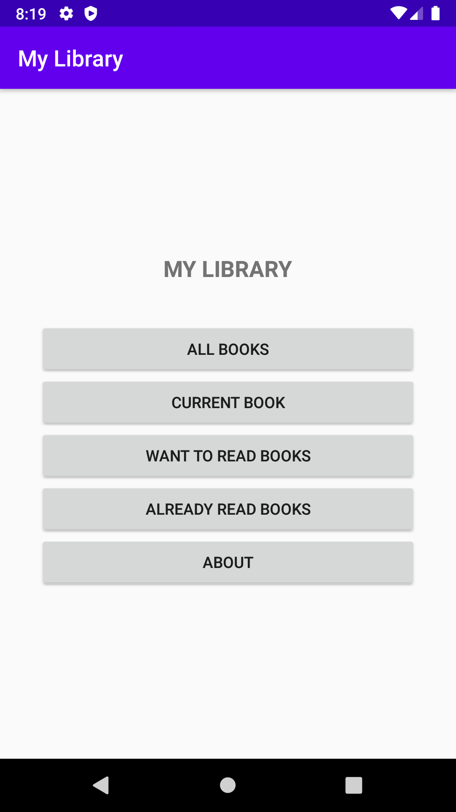
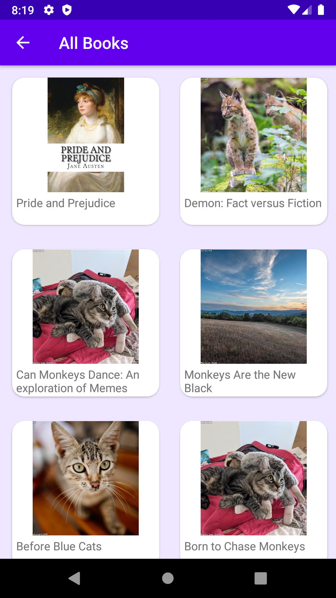
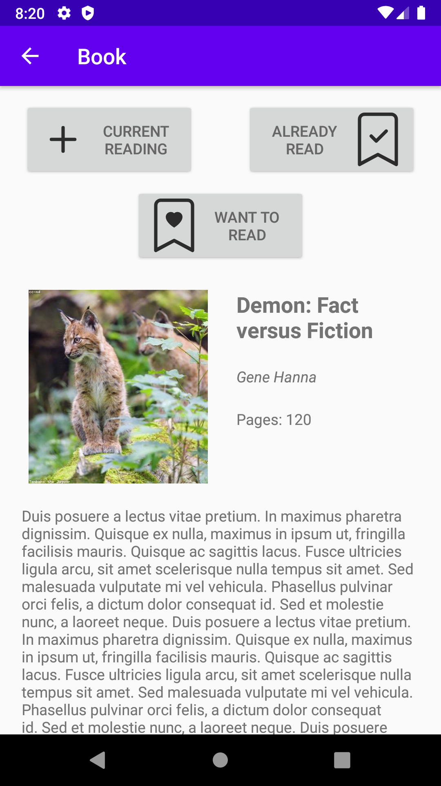
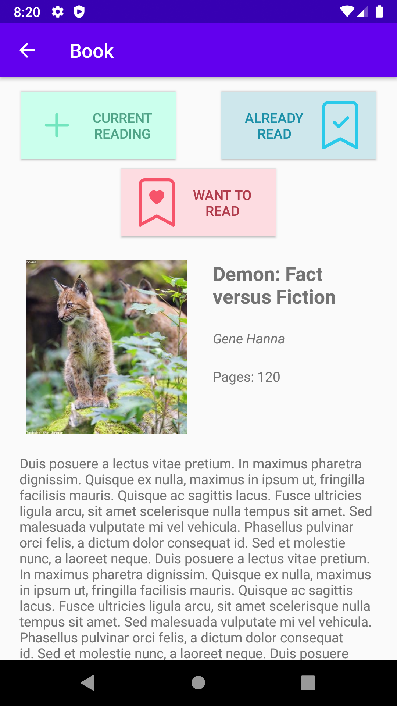
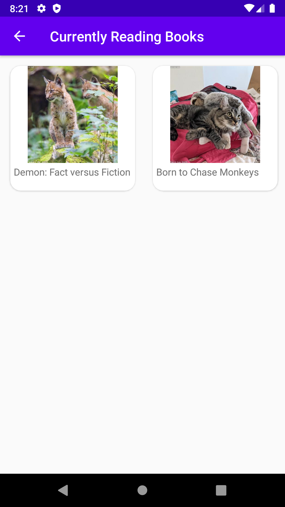
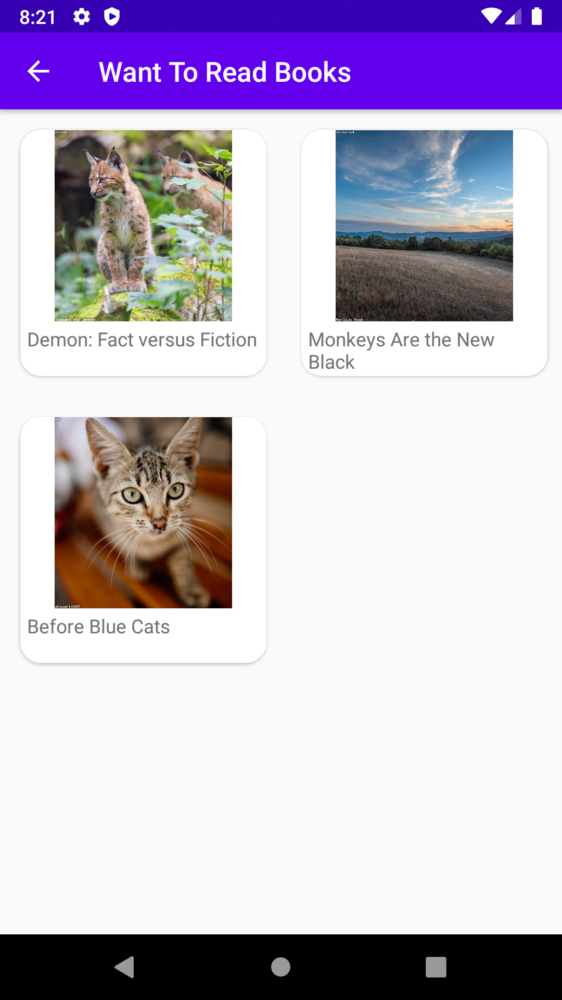

# MyLibraryApp

An app to keep track of your books. It has 4 sections: "All Books", "Current Books", "Want to Read Books", "Already Read Books".

All books part has a list of books that were predefined. Program's aim is to navigate on the pages and add some properties to the books like "finished book", "wanted book" etc.

Here is some pictures from the app.

 
  

  

  
